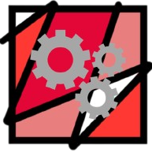
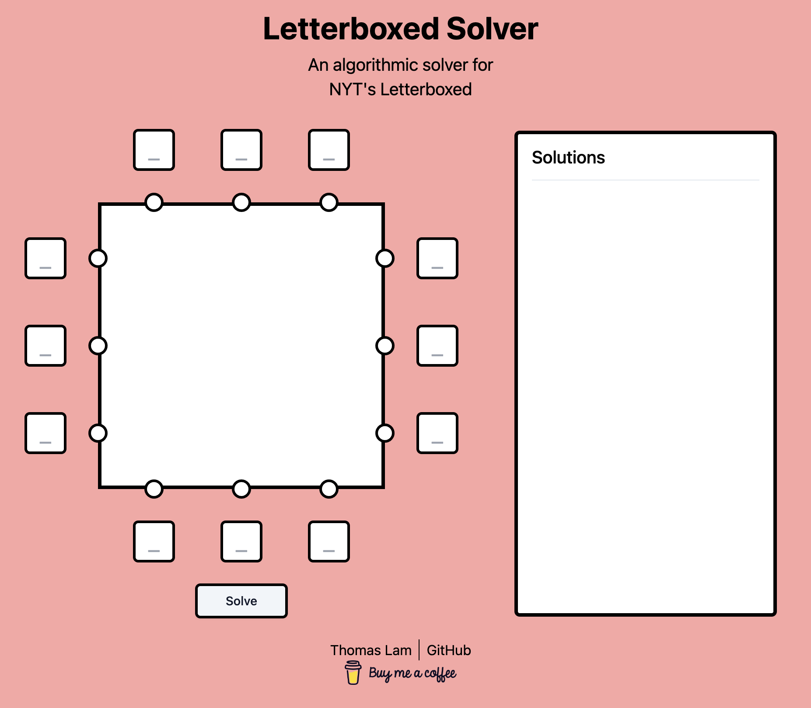

<!-- Improved compatibility of back to top link: See: https://github.com/othneildrew/Best-README-Template/pull/73 -->

<!--
*** Thanks for checking out the Best-README-Template. If you have a suggestion
*** that would make this better, please fork the repo and create a pull request
*** or simply open an issue with the tag "enhancement".
*** Don't forget to give the project a star!
*** Thanks again! Now go create something AMAZING! :D
-->

<!-- PROJECT SHIELDS -->
<!--
*** I'm using markdown "reference style" links for readability.
*** Reference links are enclosed in brackets [ ] instead of parentheses ( ).
*** See the bottom of this document for the declaration of the reference variables
*** for contributors-url, forks-url, etc. This is an optional, concise syntax you may use.
*** https://www.markdownguide.org/basic-syntax/#reference-style-links
-->

<!-- [![Contributors][contributors-shield]][contributors-url]
[![Forks][forks-shield]][forks-url]
[![Stargazers][stars-shield]][stars-url]
[![Issues][issues-shield]][issues-url]
[![MIT License][license-shield]][license-url]
[![LinkedIn][linkedin-shield]][linkedin-url] -->

<!-- PROJECT LOGO -->
 

  

<h3 align="center">Letterboxed Solver</h3>

  

    An algorithmic solver for NYT's Letterboxed
     
    <a href="https://t0mmylam.github.io/letterboxed-solver/"><strong>View Demo »</strong></a>
     
     
    <a href="https://github.com/t0mmylam/letterboxed-solver/issues">Report Bug</a>
    ·
    <a href="https://github.com/t0mmylam/letterboxed-solver/issues">Request Feature</a>
  

<!-- TABLE OF CONTENTS -->

  
Table of Contents

  <ol>
    <li>
      <a href="#about-the-project">About The Project</a>
      <ul>
        <li><a href="#built-with">Built With</a></li>
      </ul>
    </li>
    <li>
      <a href="#getting-started">Getting Started</a>
      <ul>
        <li><a href="#prerequisites">Prerequisites</a></li>
        <li><a href="#installation">Installation</a></li>
      </ul>
    </li>
    <li><a href="#usage">Usage</a></li>
    <li><a href="#roadmap">Roadmap</a></li>
    <li><a href="#contributing">Contributing</a></li>
    <li><a href="#license">License</a></li>
    <li><a href="#contact">Contact</a></li>
    <li><a href="#acknowledgments">Acknowledgments</a></li>
  </ol>

<!-- ABOUT THE PROJECT -->

## About The Project

Welcome to the Letterboxed Solver – a personal project designed to help solve the Letterboxed game from the New York Times. For those unfamiliar, Letterboxed presents you with letters arranged in a circle, and your task is to create words that start and end with these letters.

In developing this solver, I’ve employed a Trie data structure, a powerful tool for efficiently storing and retrieving words. It allows for fast and effective searching, ensuring that no possible solution is left unchecked.

This project isn’t just about finding answers; it’s also an exploration of how data structures like Trie can be applied in practical, real-world scenarios to enhance performance and results.

Feel free to use this tool next time you find yourself in a Letterboxed challenge, and watch it swiftly provide you with all the possible solutions. Enjoy solving!

(<a href="#readme-top">back to top</a>)

### Built With

-   
-   [![React][React.js]][React-url]
-   
-   
-   
-   shadcn/ui (couldn't find a md badge lol)

(<a href="#readme-top">back to top</a>)

## Roadmap

-   [x] Draw lines on the canvas when hovering over a solution
-   [ ] Make inputs into pin inputs
-   [ ] Pull data from NYT's to get gameData (will require a backend)
    - [x] Wrote python script to get today's word list
-   [ ] Present options for how the solutions are displayed
    - [ ] Hide first, second, or longer word
    - [ ] Display only first and last letters
    - [ ] Display a set number of letters
-   [ ] Add a definition section to showcase the selected answer
-   [x] Add a reset button

(<a href="#readme-top">back to top</a>)

<!-- CONTRIBUTING -->

## Contributing

Contributions are what make the open source community such an amazing place to learn, inspire, and create. Any contributions you make are **greatly appreciated**.

If you have a suggestion that would make this better, please fork the repo and create a pull request. You can also simply open an issue with the tag "enhancement".
Don't forget to give the project a star! Thanks again!

1. Fork the Project
2. Create your Feature Branch (`git checkout -b feature/AmazingFeature`)
3. Commit your Changes (`git commit -m 'Add some AmazingFeature'`)
4. Push to the Branch (`git push origin feature/AmazingFeature`)
5. Open a Pull Request

(<a href="#readme-top">back to top</a>)

<!-- CONTACT -->

## Contact

Email: thomas.lam@columbia.edu

Project Link: [https://github.com/t0mmylam/letterboxed-solver](https://github.com/t0mmylam/letterboxed-solver)

(<a href="#readme-top">back to top</a>)

<!-- ACKNOWLEDGMENTS -->

[linkedin-shield]: https://img.shields.io/badge/-LinkedIn-black.svg?style=for-the-badge&logo=linkedin&colorB=555
[linkedin-url]: https://linkedin.com/in/lamthomas
[React.js]: https://img.shields.io/badge/React-20232A?style=for-the-badge&logo=react&logoColor=61DAFB
[React-url]: https://reactjs.org/
